## Plano de marketing digital e SEO – C-Level Mobility

### 1. Premissas e contexto

- **Modelo de negócio**: transporte executivo tipo *black car* focado em **B2B corporativo**, principalmente empresas, indústrias e hotéis na região de **Jundiaí / interior paulista**, com forte uso de transfers para aeroportos (GRU, CGH, VCP) e eventos corporativos.
- **Atuais ativos e arquitetura**:
  - Landing page já estruturada em `index.html` com foco em Jundiaí, frota enxuta (Toyota Yaris) e formulário de cotação integrado a **Google Apps Script + Google Sheets** (ver `[docs/INTEGRACAO-GOOGLE-SHEETS.md](docs/INTEGRACAO-GOOGLE-SHEETS.md)` e `[docs/SOLUCAO-PROFISSA-ENXUTA.md](docs/SOLUCAO-PROFISSA-ENXUTA.md)`).
  - Fluxo operacional e de automação já pensado em `[negocio/plano-automacao.md](negocio/plano-automacao.md)`.
  - Pesquisa de mercado e análise de concorrentes já mapeadas em `[negocio/requisitos.md](negocio/requisitos.md)` e `[negocio/estudo-concorrentes.md](negocio/estudo-concorrentes.md)`.
- **Objetivo principal (0–3 meses)**: gerar **primeiros contratos e corridas pagas B2B** com empresas/indústrias/hotéis da região, usando a landing como eixo de confiança e o WhatsApp como canal de fechamento.
- **Orçamento**: praticamente zero; priorizar **Google Business Profile**, SEO on-page, conteúdo enxuto, prospecção direta e automações grátis (Apps Script, Google Sheets, integrações simples).

### 2. Arquivos a serem criados

- **Plano tático e estratégico (entregável principal)**
  - Arquivo: `[negocio/plano-marketing-digital-black-cars-service.md](negocio/plano-marketing-digital-black-cars-service.md)`.
  - Conteúdo: plano completo, com visão estratégica (12–24 meses) e plano tático de execução (90 dias), metas conservadoras e checklists.
- **Justificativa das decisões**
  - Arquivo: `[negocio/plano-marketing-decisoes-explicadas.md](negocio/plano-marketing-decisoes-explicadas.md)`.
  - Conteúdo: explicações detalhadas das escolhas de canais, prioridades, métricas, funil e ferramentas, sempre ligando com os documentos já existentes no projeto.

### 3. Visão estratégica (12–24 meses)

- **Posicionamento**
  - Ser percebido como **serviço de transporte executivo enxuto, confiável e especializado em Jundiaí e região**, para um **número limitado de contas corporativas** (indústrias, hotéis, empresas de médio/grande porte).
  - Diferencial: **foco em processos e comunicação bem orquestrados**, usando automação e tecnologia para dar uma experiência de “empresa grande” mesmo com operação pequena.
- **Pilares estratégicos**
  - **Pilar 1 – Presença digital mínima porém sólida**: landing multilíngue (pt/EN/ES) + Google Business Profile forte + página no LinkedIn.
  - **Pilar 2 – Autoridade local**: conteúdo pontual mas bem direcionado sobre rotas Jundiaí–aeroportos, atendimento a indústrias, hotéis e executivos, usando blog/MD no Git + publicação enxuta.
  - **Pilar 3 – Relacionamento com poucas contas-chave**: priorizar 5–10 empresas/hotéis-alvo e desenhar o funil quase 1:1 (visita + follow-up + acordo de testes + relatórios simples).
  - **Pilar 4 – Automação como bastidor**: usar o fluxo de `[negocio/plano-automacao.md](negocio/plano-automacao.md)` para garantir resposta rápida e registro de todos os leads, com evoluções graduais.

### 4. Funil de aquisição pensado para o marketing

```mermaid
flowchart LR
  topo[Topo do funil] --> atracao[Atração: buscas Google + indicações + LinkedIn]
  atracao --> visita[Visita à landing]
  visita --> lead[Lead: formulário ou WhatsApp]
  lead --> qualif[Qualificação e proposta]
  qualif --> agendamento[Agendamento de corrida]
  agendamento --> corrida[Execução da corrida]
  corrida --> posVenda[Pós-venda e follow-up]
  posVenda --> recorrencia[Contratos e recorrência B2B]
```

- **Ponto de controle do marketing**: da **atração** até o **lead** (visita, clique, formulário, origem do tráfego), com influência na comunicação até a **qualificação**.
- **Ponto de controle operacional**: da **qualificação** em diante (agendamento, execução, pós-venda), já mapeado no plano de automação.

### 5. Plano tático 0–90 dias (SEO + marca + prospecção)

#### 5.1. Semana 1–2 – Fundamentos de presença e confiança

- **Domínio e site no ar**
  - Garantir registro de domínio (mesmo que já exista, validar naming alinhado com o posicionamento).
  - Publicar a landing `index.html` usando a arquitetura descrita em `[docs/SOLUCAO-PROFISSA-ENXUTA.md](docs/SOLUCAO-PROFISSA-ENXUTA.md)` (S3/CloudFront ou alternativa gratuita/mais barata temporária se necessário).
- **Google Business Profile (GBP)**
  - Criar/otimizar ficha **“C-Level Mobility – Transporte executivo em Jundiaí”** com:
    - Descrição coerente com os textos da landing (serviços, rotas principais, foco em empresas/hotéis).
    - Categoria adequada (transporte executivo / serviço de motorista / transporte de passageiros).
    - Áreas atendidas: Jundiaí, cidades-chave da região, caminhos até aeroportos.
    - Link para o site (landing) e WhatsApp.
  - Planejar captação de **primeiras avaliações** (de corridas reais) com textos objetivos.
- **Configurações técnicas mínimas de SEO no site**
  - Conferir/ajustar no `index.html`:
    - `title` e `meta description` já bem alinhados a **“transporte executivo em Jundiaí e região”** (já existe, só refinar se necessário).
    - Marcações de headings (`h1`, `h2`) coerentes com palavras-chave da região (transporte executivo Jundiaí, transfers para aeroportos, empresas e hotéis).
    - Links internos `#services`, `#fleet`, `#business`, `#contact` bem descritos (já estão, podem ser refinados com base no estudo de concorrentes).
  - Incluir (no futuro, se fizer sentido) marcação estruturada simples (JSON-LD LocalBusiness), mas isso pode ficar para a fase de execução.

#### 5.2. Semana 2–4 – Geração de leads iniciais (rápidos) e aprendizagem

- **Prospecção direta B2B (baixo volume, alta qualidade)**
  - Criar uma lista de **10–20 empresas/hotéis-alvo** em Jundiaí e região (indústrias, hotéis de negócios, centros de eventos), com apoio de pesquisa manual e informação local.
  - Para cada alvo:
    - Identificar contato de **RH, Facilities, Compras ou Gerente Geral (no caso de hotel)**.
    - Enviar e-mail curto e direto apresentando o serviço (link para a landing + CTA para teste de 1–2 corridas pagas).
    - Oferecer **roteiros de teste** em horários estratégicos (ex.: início/fim de turno, visitas de fornecedores, transporte de hóspedes).
- **Uso do LinkedIn**
  - Criar/otimizar **página da empresa no LinkedIn** com descrição alinhada ao site.
  - Perfil pessoal do fundador/motorista com foco em:
    - Conteúdos rápidos (1–2 por semana) sobre logística de executivos em Jundiaí, aeroportos, aprendizado com corridas (sem expor clientes), dicas de horários.
    - Conexão com gestores das empresas-alvo.
- **Campanha manual de WhatsApp**
  - Para contatos obtidos em eventos/visitas/indicações, enviar mensagem curta com:
    - Apresentação.
    - Link do site.
    - CTA para teste em data específica.
  - Não é disparo em massa; é **1:1 com contexto**, para não ferir regras de spam.

#### 5.3. Semana 4–8 – Ajustes de mensagem e começo de conteúdo SEO

- **Micro-conteúdos orientados a busca local**
  - Criar seções/anchors (podem ser blocos de texto dentro do `index.html` ou em um futuro `/blog`) com foco em:
    - “Transporte executivo de Jundiaí para GRU/CGH/VCP”.
    - “Transporte executivo para hóspedes de hotéis em Jundiaí”.
    - “Serviço de motorista para indústrias do eixo Jundiaí–Campinas–São Paulo”.
  - Cada texto curto (300–600 palavras), usando linguagem profissional e incorporando aprendizados de `[negocio/estudo-concorrentes.md](negocio/estudo-concorrentes.md)`.
- **Ajustes de oferta com base em respostas reais**
  - Usar a planilha de leads (via Google Sheets) para registrar:
    - Origem do lead (GBP, e-mail direto, LinkedIn, indicação).
    - Tipo de serviço mais pedido.
    - Taxa de conversão em corridas fechadas.
  - Com isso, priorizar mensagens que mais geram corridas (ex: se transfers para VCP começam a dominar, reforçar isso no site e na GBP).

#### 5.4. Semana 8–12 – Consolidação e primeiras provas sociais

- **Coleta ativa de avaliações no Google**
  - Após corridas bem-sucedidas, enviar link direto para avaliação na ficha do Google Business Profile.
  - Orientar clientes a mencionar **Jundiaí, aeroportos, empresa/hotel, pontualidade** (sem roteiros prontos, mas sugerindo pontos relevantes).
- **Cases curtos B2B (sem nomes se necessário)**
  - Criar 2–3 mini-cases como texto para a landing ou LinkedIn, por exemplo:
    - “Como uma indústria de Jundiaí organizou transfers semanais para GRU com previsibilidade de horário”.
  - Foco em resultado lógico (menos stress, previsibilidade, conforto), sem exageros.

### 6. Métricas e metas conservadoras

- **Indicadores principais (0–3 meses)**
  - Visitas mensais ao site (via GA4 ou alternativa leve): alavancar para algo na faixa de **50–150 visitas/mês** no início, com crescimento gradual.
  - Leads (formulário + WhatsApp vindos da landing/GBP): **5–15 leads/mês**.
  - Corridas B2B pagas oriundas desses leads: **2–5 corridas/mês** no começo, com potencial de escalar para pacotes recorrentes.
  - Num cenário conservador, **1–3 contratos recorrentes** de empresas/hotéis em 6–12 meses já é um bom resultado para o porte atual.
- **Ferramentas gratuitas para acompanhar**
  - Google Analytics 4 (ou alternativa leve) para visitas e eventos básicos.
  - Google Search Console para impressões/clicks em buscas.
  - Planilha Google Sheets atual como CRM inicial (já integrada pelo Apps Script).

### 7. Automação e ferramentas (sempre baixo custo)

- **Curto prazo (já)**
  - Usar o fluxo descrito em `[docs/INTEGRACAO-GOOGLE-SHEETS.md](docs/INTEGRACAO-GOOGLE-SHEETS.md)` para garantir que **todo lead cai em planilha + dispara e-mail de notificação**.
  - Implementar (se ainda não estiver) respostas rápidas no **WhatsApp Business** para consultas comuns (preço base, áreas atendidas, como funciona o agendamento).
- **Médio prazo (após alguns leads recorrentes)**
  - Adicionar automações simples com **Apps Script** ou ferramentas self-hosted como **n8n** (se fizer sentido e couber no orçamento de infra):
    - Novo lead na planilha → mensagem padrão de recebimento (e-mail/WhatsApp manualmente articulado a partir de um template).
    - Lead que não respondeu em X dias → criar lembrete em agenda ou lista de tarefas.
- **Longo prazo**
  - Evoluir para o nível descrito em `[docs/SOLUCAO-PROFISSA-ENXUTA.md](docs/SOLUCAO-PROFISSA-ENXUTA.md)` com API Gateway/Lambda apenas quando volume e necessidade de marcação de domínio justificarem.

### 8. Estrutura do arquivo de justificativas

- No arquivo `[negocio/plano-marketing-decisoes-explicadas.md](negocio/plano-marketing-decisoes-explicadas.md)`, a organização será:
  - **Introdução**: resumo do contexto e dos objetivos.
  - **Por que B2B corporativo em Jundiaí/região**: ligação direta com pesquisa de mercado e estudo de concorrentes.
  - **Escolha de canais**: motivo de priorizar Google Business Profile, SEO local, LinkedIn e prospecção direta, deixando anúncios pagos para depois.
  - **Funil e métricas**: explicação de como cada etapa do funil influencia faturamento e o que é considerado resultado realista.
  - **Ferramentas e automações**: justificativa de cada ferramenta gratuita / quase gratuita e como se encaixa na visão de arquitetura enxuta.
  - **Roteiro de evolução**: por que adiar certas coisas (ex.: app próprio, campanhas pagas) para fases futuras.

### 9. Estilo e tom dos textos

- Todos os textos do plano e do arquivo de justificativas terão:
  - **Tom profissional, feliz e orientado a solução**, deixando claro que o projeto é enxuto mas ambicioso.
  - Estimativas **conservadoras**, sem promessas irreais de volume de leads ou faturamento.
  - Foco constante em **disciplina de execução** (rotina semanal de prospecção, pedidos de avaliação, atualização de planilha) como principal alavanca.

