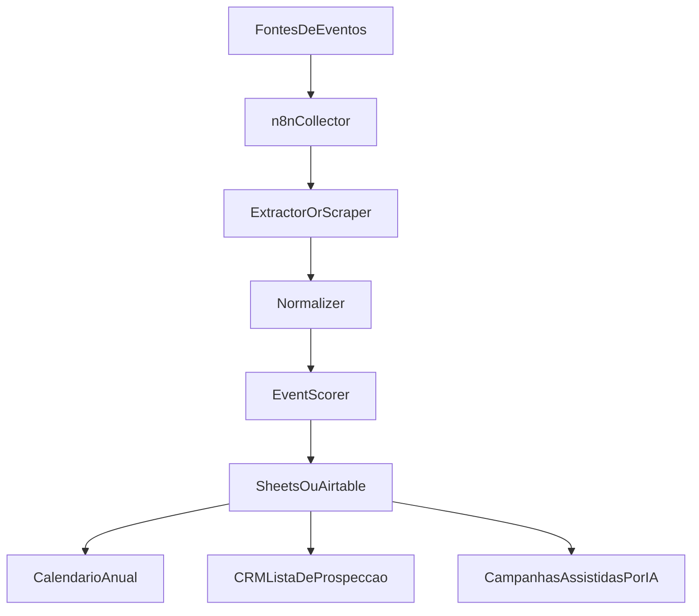

# Automacao de eventos e inteligencia comercial

Sim, isso faz bastante sentido para a C-Level Mobility. Para o seu tipo de operacao, "mapear eventos" nao e so uma lista de agenda: pode virar um sistema de inteligencia comercial territorial, principalmente se o foco for empresas, executivos, visitantes, aeroportos, hoteis e deslocamentos com previsibilidade.

O jeito mais util de pensar nisso e separar em 3 camadas:

1. detectar eventos com potencial de demanda
2. qualificar quais realmente importam
3. ativar campanhas e prospeccao com antecedencia

## Que tipos de eventos explorar

Além de feiras, congressos e shows, eu olharia para eventos que geram fluxo executivo, visitantes corporativos, deslocamentos aeroporto-hotel-evento e agendas planejadas.

Boas categorias:

- **feiras de negocios e exposicoes setoriais**
- congressos e seminarios corporativos
- convencoes empresariais
- encontros de associacoes, sindicatos e federacoes
- roadshows de marcas e lancamentos B2B
- assembleias, encontros de distribuidores e canais
- eventos em hoteis corporativos e centros de convencoes
- foruns de RH, facilities, compras, logistica e industria
- formaturas premium e eventos institucionais de universidades
- agendas esportivas de alto fluxo em cidades-alvo
- shows grandes e festivais
- eventos religiosos de grande porte
- visitas de delegacoes, missoes empresariais e eventos diplomaticos
- leiloes, encontros do agro, eventos automotivos e industriais
- calendarios de parques de exposicao, centros de convencoes e arenas
- temporadas de alta demanda por aeroporto, nao necessariamente ligadas a um "evento" unico

Para a C-Level Mobility, eu priorizaria primeiro o que mais se conecta com seu posicionamento:

- eventos corporativos
- centros de convencoes
- hoteis executivos
- agendas B2B regionais
- eventos que trazem publico de fora para Jundiai, Campinas, Sao Paulo e aeroportos

Shows e festivais podem gerar demanda, mas em geral sao menos aderentes ao discurso de previsibilidade, documentacao e atendimento corporativo. Eu trataria isso como camada secundaria.

## Como pensar a automacao

O modelo mais inteligente nao e "raspar tudo". E montar um pipeline:

Fontes -> coleta -> normalizacao -> qualificacao -> calendario -> campanhas

### 1. Fontes de dados

Voce pode combinar:

- sites oficiais de centros de convencoes
- agendas de hoteis com espaco para eventos
- portais de feiras e congressos
- Sympla, Eventbrite e plataformas semelhantes
- calendarios de prefeituras e secretarias de turismo
- agendas de associacoes setoriais
- sites de arenas, casas de show e parques de exposicao
- Google Events e resultados de busca estruturados
- redes sociais de organizadores
- newsletters de eventos e turismo de negocios
- bases pagas ou diretorios setoriais, se fizer sentido depois

### 2. Coleta

As formas principais seriam:

- RSS/API quando existir
- scraping leve de paginas estruturadas
- monitoramento de paginas especificas
- ingestao manual assistida para fontes criticas
- enriquecimento posterior com IA

Minha recomendacao: comecar com coleta hibrida, nao 100% automatica.
Algumas fontes serao confiaveis e estaveis; outras quebram com frequencia.

## n8n: faz sentido?

Sim, bastante.

O `n8n` e uma boa peca de orquestracao para esse caso porque ele pode:

- rodar agendamentos
- buscar paginas/APIs
- transformar dados
- chamar modelos de IA para extrair campos
- gravar em planilha, banco ou Notion
- acionar campanhas, alertas e CRM

### Onde ele entra bem

- rodar jobs diarios/semanais
- visitar listas de fontes
- detectar novos eventos
- comparar com eventos ja mapeados
- mandar alertas quando surgir evento relevante
- alimentar um calendario mestre
- disparar workflows comerciais por antecedencia

### Limite do n8n

O `n8n` nao e, sozinho, o melhor scraper do mundo para paginas dificeis.
Ele e otimo como orquestrador. Para scraping mais robusto, vale acoplar com:

- Playwright
- Puppeteer
- Apify
- Browse AI
- scripts Python
- um microservico de scraping

## Local ou hospedado?

### Local

Bom para:

- prototipo rapido
- custo inicial baixo
- validar o desenho
- aprender o processo

Ruim para:

- confiabilidade
- execucao continua
- historico e monitoramento
- dependencia da sua maquina estar ligada

### Hospedado

Bom para:

- rodar todo dia sem depender de voce
- manter historico
- alertas consistentes
- uso comercial real

Ruim para:

- custo
- mais cuidado com credenciais e infraestrutura

### Recomendacao pratica

Eu faria em 3 fases:

1. fase 1: local
  Use `n8n` local ou Docker local para validar o pipeline e as fontes.
2. fase 2: semi-estavel
  Suba em VPS simples ou servico gerenciado.
3. fase 3: producao
  Banco + calendario + scoring + campanhas automatizadas.

Se a ideia for virar rotina comercial de verdade, eu tenderia a hospedado depois da validacao.

## Web scraping: usar ou nao?

Sim, mas com criterio.

### Onde usar

- agendas publicas sem API
- paginas de calendario de eventos
- listagens repetitivas e estruturadas
- fontes que mudam pouco

### Cuidados

- respeitar termos de uso
- evitar scraping agressivo
- tratar bloqueios, CAPTCHAs e paginas instaveis
- registrar a fonte e a data da coleta
- nao confiar cegamente no texto bruto
- revisar dados criticos antes de usar em campanha

### Melhor pratica

Use scraping para capturar candidatos a oportunidade.
Depois aplique uma camada de qualificacao.

Exemplo de campos extraidos:

- nome do evento
- tipo
- organizador
- data
- local
- cidade
- endereco
- link oficial
- publico estimado
- perfil do publico
- setor
- faixa de preco
- palavras-chave
- necessidade provavel de mobilidade
- janela comercial ideal
- score de relevancia

## O que mais usar alem de n8n e scraping

Voce pode montar uma stack simples e muito boa com:

### Coleta/orquestracao

- n8n
- scripts Python
- Playwright
- Apify

### Armazenamento

- Google Sheets para comecar
- Airtable se quiser algo mais organizado
- Notion se quiser base visual simples
- Postgres se quiser algo mais serio desde cedo

### Enriquecimento com IA

- classificar tipo de evento
- resumir paginas
- extrair dados de paginas despadronizadas
- inferir relevancia comercial
- sugerir abordagem comercial
- gerar mensagens segmentadas

### Visualizacao

- Google Calendar
- Notion calendar
- Looker Studio
- Metabase
- dashboard simples em Airtable/Sheets

### Ativacao comercial

- HubSpot
- Pipedrive
- listas de prospeccao
- e-mail/WhatsApp assistido
- sequencias por antecedencia do evento

## Como eu desenharia o sistema

### Camada 1: calendario mestre

Um registro unico de eventos com campos padronizados.

Campos minimos:

- nome do evento
- categoria
- setor
- cidade
- local
- data de inicio e fim
- fonte
- organizador
- URL
- perfil esperado do publico
- publico estimado
- potencial para traslado executivo
- potencial para traslado aeroporto
- potencial para empresas visitantes
- prioridade comercial
- status de acao

### Camada 2: score comercial

Nem todo evento vale esforco.

Voce pode criar um score simples de 0 a 100 baseado em:

- proximidade geografica
- perfil corporativo
- duracao do evento
- porte estimado
- publico de fora da cidade
- presenca em hotel/centro de convencoes
- aderencia ao ICP
- antecedencia suficiente para acao
- recorrencia anual
- existencia de patrocinadores/expositores relevantes

### Camada 3: janela de acao

Exemplo:

- 90 dias antes: mapear e priorizar
- 60 dias antes: prospectar hoteis, organizadores, parceiros, empresas expositoras
- 30 dias antes: campanha ativa
- 7 dias antes: operacao tatica, mensagens rapidas, disponibilidade
- pos-evento: follow-up e aprendizado

## Calendario anual: vale muito a pena?

Sim. Isso e uma das partes mais valiosas.

Porque um calendario anual permite:

- prever sazonalidade
- planejar campanhas com antecedencia
- identificar picos de demanda por regiao
- organizar a operacao
- testar ofertas especificas por tipo de evento
- comparar ano contra ano

Mais importante: ele tira voce do modo "reagir ao que apareceu" e coloca em modo "antecipar demanda".

Eu faria dois calendarios:

### 1. Calendario bruto de mercado

Todos os eventos capturados.

### 2. Calendario comercial priorizado

So eventos com score relevante para acao.

## Da para usar isso em campanhas?

Sim, e esse e o ponto mais forte.

### Tipos de campanha possiveis

- campanhas por setor:
"Mobilidade para feiras industriais", "para congressos medicos", etc.
- campanhas por cidade/regiao:
Jundiai, Campinas, Sao Paulo, eixo aeroportos
- campanhas por momento:
"Sua equipe vai receber visitantes neste congresso?"
- campanhas para hoteis e organizadores
- campanhas para expositores
- campanhas para empresas com executivos visitantes
- campanhas de retargeting com base em paginas/eventos especificos

### Tipos de oferta

- traslado aeroporto-hotel-evento
- atendimento para executivos e palestrantes
- logistica para convidados e visitantes
- janela dedicada para convencoes e roadshows
- operacao com faturamento/documentacao para empresa

### IA pode ajudar aqui tambem

Com os dados dos eventos, voce pode gerar:

- listas segmentadas de oportunidades
- argumentos por evento/setor
- mensagens de prospeccao adaptadas
- one-pagers tematicos
- calendario editorial/comercial
- alertas de oportunidade

## Melhor arquitetura para comecar

Eu nao comecaria com algo complexo demais.

### MVP recomendado

- `n8n`
- Google Sheets ou Airtable
- 10 a 20 fontes prioritarias
- scraping leve + input manual assistido
- classificacao simples por score
- calendario comercial mensal/trimestral
- campanha manual assistida por IA

### Depois

- banco mais estruturado
- enriquecimento automatico
- dashboard
- integracao com CRM
- alertas automaticos
- campanhas semi-automatizadas

## Uma arquitetura simples de MVP

## Minha recomendacao objetiva

Se eu estivesse desenhando isso para voce, faria assim:

1. comecar por eventos corporativos e institucionais, nao por shows
2. usar `n8n` como orquestrador
3. usar planilha ou Airtable no comeco
4. usar scraping so nas fontes que realmente valem a pena
5. criar score de oportunidade
6. montar calendario anual e calendario comercial priorizado
7. usar os dados para campanhas por setor, cidade e janela do evento
8. so depois sofisticar com hospedagem estavel, CRM e IA mais forte

## O maior risco

O maior risco nao e tecnico. E virar um sistema que coleta muito e gera pouca acao.
Entao o criterio principal deve ser:

- isso gera lead?
- gera parceria?
- gera timing comercial melhor?
- melhora previsao operacional?

